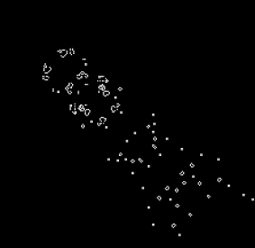

Conway's Game of Life
======================
Conway's game of Life is a cellular automaton devised by mathematician John Conway in 1970. It consists of a grid of cells, where each
cell can have one of two states: alive or dead.

Once the grid has been populated by an initial number of live cells, the following rules come into effect:
  1. Any live cell with less than 2 neigbors** dies
  2. Any live cell with 2 or 3 neighbors survives
  3. Any live cell with more than 3 neigbors dies
  4. Any dead cell with exactly 3 neigbors comes back to life

These four simple rules can result in surprisingly complex patterns evolving from an initial starting point.
The initial configuration of the grid is called the **seed** and the same starting seed always produces the same patterns and results.

** neighbors: In this context, _neighbors_ refers to cells in the Moore neighborhood (grey) of the target cell (black)


Instructions:
-------------
 1. Clone the Life repo
 2. Compile src/Life.java
 3. Two options for running from command line:

    + Using preset start seed: **\> java Life grid_size start_seed refresh_delay**  
       Where **start_seed** is one of:  
         i)   blinker  
         ii)  glider  
         iii) pento  
         iv)  acorn  
         v)   lwss  

      A lower **grid_size** results in better performance. I recommend setting this to around 700 max  

      **refresh_delay** is the number of milliseconds between each generation

    + Using a custom GRID file:  **\>java Life filename**  
       These can be found in the grids/ directory

Examples:
---------
```

```

    

Left: Start seed 'acorn'. Right: The result of running the program for a few generations


  
 A few generations into ark.grid  

  
A Gosper Gun creating a steady stream of gliders. Found in biggun.grid.  

  
A spaceship called a Rake leaves behind a stream of gliders as it travels horizontally. Found in bigrake.grid.  